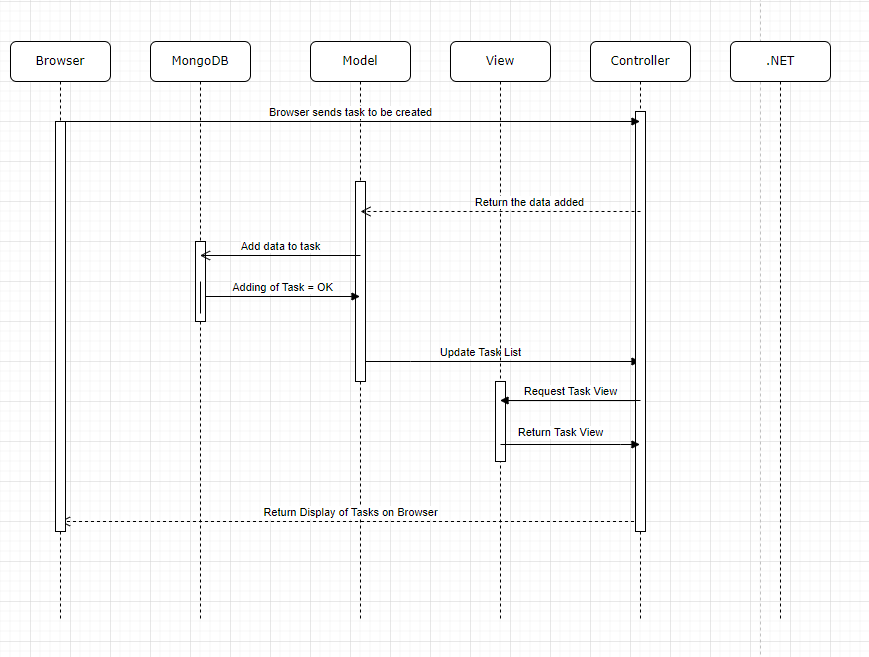

# Lab 4 Writeup

Name: Caroline Grahl
Date: 03/16/2022
Lab 4a - .NET Core MVC Part 1 + Lab 4b - .NET Core MVC Part 2

### Executive Summary
The objective of this lab was to learn more about **Model-View-Controller (MVC)** ideology and use it with knowledge obtained from previous labs that used **HTML**, **CSS**, **JavaScript**, and **PHP**. Students also were able to use **MongoDB**, a **Atlas**, and **Azure** to implement new things to their web page. 

### Design Overview 

**Google email**

**Tasks have different status**

**Second task deleted**

**Sequence Diagram for Create function**

**Sequence Diagram for Read function**

**Sequence Diagram for Update function**

**Sequence Diagram for Delete function**

### Writeup Questions 

1. In the context of MongoDB compared to SQL databases, what's a Document? What's a Collection?

A Document is the equivalent to a Row or Record in Relational Databases. A Collection is a table. NoSQL has different names for the same things on Relational Databases. 

2. When you log in with Google, where is the hash of your password stored? Your app, Google, or both?

One of the advantages of using OAuth is that there is no risk of data breach. Therefore, when logging in with Google, the hash of a password is stored in Google. 

3. What's the difference between using Cloud services to store data (like Atlas) and storing data locally with something like MySQL? List 2 benefits of each approach.

When a developer or user use Cloud services to store data, they are using a network of remote servers that are hosted on the internet. These servers provide the ability to manage, store, and process data. When storing data locally, the developer or user are storing things on physical storage devices, like Hard disk drives (HDD), Solid state drives (SSD), or any local storage device. 

**Benefits of using Cloud Services:**
- Data can be retrieved from virtually anywhere 
- Teams can collaborate from anywhere

**Benefits of using Local Storage:**
- Quicker access to data
- Security control over how data is stored or accessed

4. List 3 core features of fully-fledged IDE's like Visual Studio that give them an advantage over text-editors like Sublime or VSCode.

- Developer can use Visual Studio to publish things to Azure (configuring every step of the way)
- Can implement Classes and DAOs (Data Access Object Model) with just a few clicks
- Can build mobile apps, universal windows apps, games, etc.  

5. What is the role of a Model?

A Model is pure application logic, which interacts with the database. Data can be retrieved from the database, then it can be manipulated and updated back to the database or use it to render data. 

6. What is the role of a View?

A View represents the HTML files that interact with the end user. It is all the UI components that a user will interact with, like dropdwon menus, text boxes, etc.

7. What is the role of a Controller?

A Controller acts as the bridge between a View and a Model. It processes all business logic and incoming requests. 

8. List 3 pros and 3 cons of hosting your website on the cloud.

**Pros:**
- Data Reliability
- Better Storage Capacity
- Group Collaboration

**Cons:**
- Slow Speed 
- Unsecure Data
- Lost Data

### Lessons Learned 

##### UML Sequence Diagram

Because there are many types of UML diagrams, developers can mix them up and use the wrong tools. Therefore, knowing that Sequence Diagrams are used for procedures, functions, or operations is important and can help when trying to understand how these procedures, functions, or operations work. Using the correct message symbols is important because there are many (relaying a message, replying to a message, creating a message, activation boxes, etc.).

##### CRUD Functions

CRUD stands for **Create**, **Read**, **Update**, and **Delete**. These operations are necessary to implement a persistent storage application. If not implemented properly, the data that needs to be retained will not be stored on the database. Visual Studio build a scaffolded code by right-clicking on the **Controllers** folder and select Add> New Scaffolded Item and follow the prompts for the MVC Controllers with Views. 

##### Publishing to Azure

Publishing to Azure can be a very frustrating experience because things need to be working properly before they are pushed. Making sure that the Hosting section is properly set up can avoid error messages in logs later on. Setting up the Google authenticator and Atlas Settings require double underscores ("Authentication__Google__ClientId" without the quotes). Putting the unique ClientId will allow clients to save time and register and log in with their Google accounts.

### Conclusions 

- Use OAuth2 to allow users to register and log into web site using Google account
- Use MongoDB (NoSQL) to store data in the cloud
- Use CRUD functions with C# to perform tasks within web site

### References 
1. [Create a web API with ASP.NET Core and MongoDB ](https://docs.microsoft.com/en-us/aspnet/core/tutorials/first-mongo-app?view=aspnetcore-3.1&tabs=visual-studio#add-an-entity-model)
2. [Authentication and Authorization in ASP.NET Web API ](https://docs.microsoft.com/en-us/aspnet/web-api/overview/security/authentication-and-authorization-in-aspnet-web-api)
3. [IEnumerable - C# ](https://www.tutorialspoint.com/What-does-the-interface-IEnumerable-do-in-Chash)

### Feedback 

Great lab, regardless of how stressful it was to publish things to Azure. TAs were wonderful, as usual. 